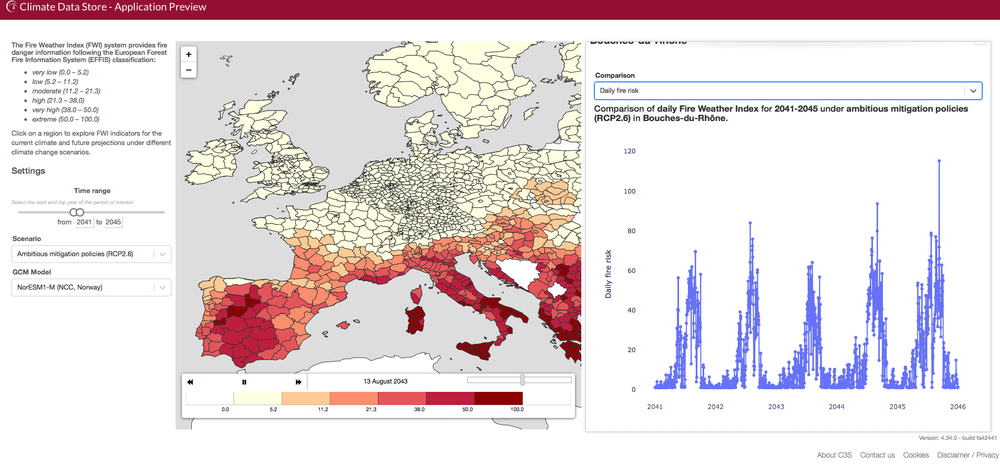
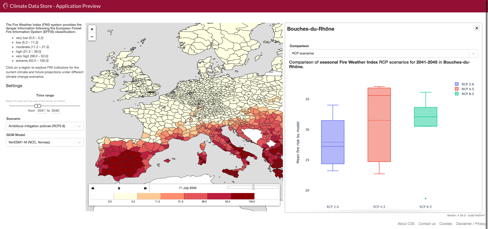

# Fire risk forecast with cds-copernicus

## Usage of the code
This code is intended to work in the toolbox-editor section of [cds.climate.copernicus.eu](https://cds.climate.copernicus.eu). However, it seems to be possible to download the toolbox and data and work on pyhton.

## Running product
The final product can be found [here](./final/FinalProduct.py)

## Results
The final product enables the user to select a time period, a scenario and a model, and to see the average fire fire risks over the selected period, for the selected scenarios and model and by region in Europe. The user can then select a particular geographical region and choose between 3 data visualisations : 

### Daily fire risk

The user can see the forecasted daily fire risk fpor the selected time range.

### Various scenarios

The user can see the forecasted average fire risk for the various climate change scenarios.

### Time horizons

The user can select a climate change scenario and the forecasted average fire risk over various time periods.